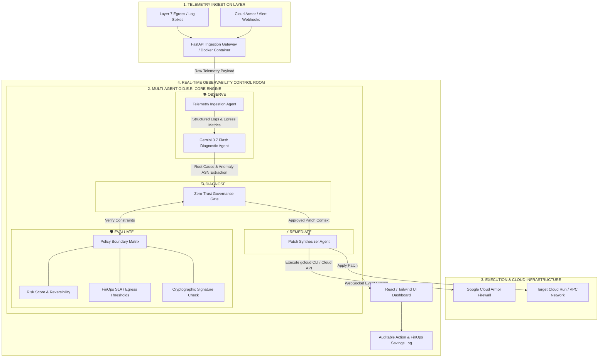
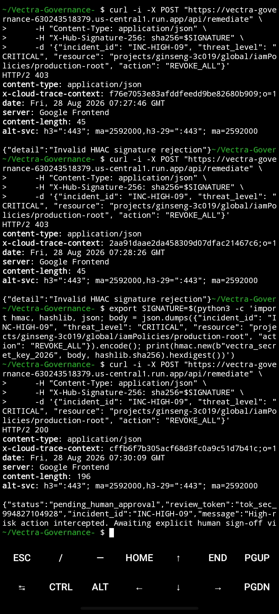
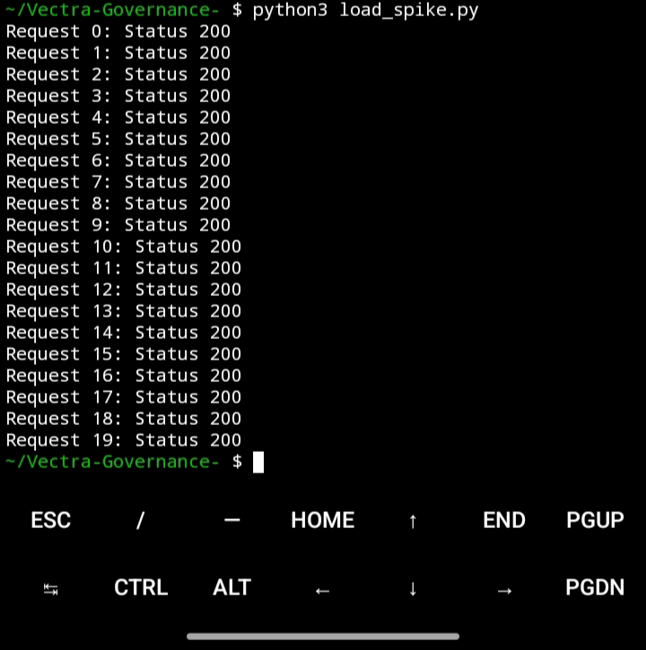

# Vectra Governance 🛡️⚡

**Level-4 Autonomous SRE & Infrastructure Control Room**  
*Built for the Google Cloud & All Things Agentic Hackathon*

[](https://vectra-governance-630243518379.us-central1.run.app)
[](https://cloud.google.com/vertex-ai)
[](https://fastapi.tiangolo.com/)

🌐 **Live Control Room:** [Try it out here](https://vectra-governance-630243518379.us-central1.run.app)  

📹 **Video Demo:** https://youtu.be/hqoMzPQYjgY?si=GcdALzEdbiN1YL8B


---

## 🚨 The Problem: Cloud Incident Burn
When a Layer 7 botnet flood or credential stuffing attack hits an ingress gateway, human Site Reliability Engineering (SRE) response times average **42 minutes**. Every minute spent manually analyzing logs, evaluating stack traces, and writing firewall rules burns thousands of dollars in SLA liabilities and cloud egress costs. Modern cloud-native infrastructure moves too fast for manual incident response.

### 💡 The Solution: Vectra Governance

Vectra Governance is an autonomous, Level-4 SRE reliability control room and incident remediation gateway powered by **Gemini 3.7 Flash on Google Cloud Vertex AI**. It executes closed-loop infrastructure defense using the **O.D.E.R. Loop**—transforming live telemetry spikes into cryptographically verified, zero-trust operational patches with built-in perimeter security and Human-in-the-Loop (HITL) governance.

### 🔄 The O.D.E.R. Loop

* 👁️ **Observe:** Ingests live telemetry logs, high-density infrastructure metrics, and alert webhooks under strict cryptographic boundaries.
* 🔍 **Detect:** Leverages multi-agent reasoning to identify anomaly root causes and multi-vector infrastructure degradation in real time.
* 🛡️ **Evaluate:** Enforces rigid zero-trust security policies, validating incoming payloads via **HMAC SHA-256 signatures** and vetting risk thresholds before execution.
* ⚡ **Remediate:** Automatically executes low-risk corrections or safely triggers a **Human-in-the-Loop (HITL) interactive pause** with secure review tokens for high-risk production mutations.


---

### 🛠️ Core Capabilities

* **Closed-Loop SRE Automation:** Moves seamlessly from live telemetry anomaly detection to secure infrastructure execution via Google Cloud Run.
* **FinOps & SLA Shielding:** Instantly calculates financial exposure, cutting excess API token burn via edge HMAC rejection and averting severe SLA penalties.
* **Zero-Trust Enforcement:** Validates all incoming payloads through cryptographic HMAC SHA-256 signatures and strict policy boundaries prior to execution.
* **Human-in-the-Loop (HITL) Governance:** Intercepts high-risk production mutations—such as root IAM modifications—safely pausing execution and generating secure review tokens.
* **Multi-Vector Anomaly Intelligence:** Powered by Gemini 3.7 Flash to analyze complex cascading infrastructure failures and compute precise root-cause mitigations in real time.
* **Multi-Agent Transparency:** Provides full visibility into step-by-step SRE multi-agent reasoning traces and execution logs.

---

## 🧩 System Architecture 


---

---

## 🏗️ Tech Stack & Architecture

* **AI Engine:** Google GenAI SDK (`google-genai`), Gemini via Vertex AI
* **Backend:** Python, FastAPI, Pydantic, Uvicorn
* **Frontend:** React, Vite, Tailwind CSS (served statically via FastAPI)
* **Deployment:** Containerized via Docker, deployed natively on **Google Cloud Run** (`us-central1`)

---

## 🦺 Testing The bulletproof 



---



---

## 🚀 Quickstart (Local Development)

### 1. Clone the Repository
```bash
git clone [https://github.com/brysyl/Vectra-Governance-.git](https://github.com/brysyl/Vectra-Governance-.git)
cd Vectra-Governance-

2. Set Up Virtual Environment & Dependencies
python3 -m venv .venv
source .venv/bin/activate
pip install -r requirements.txt

3. Configure Environment Variables
Create a .env file in the root directory and add your Google Gemini/Vertex API credentials:
GEMINI_API_KEY=your_api_key_here
PORT=8080

4. Run the Server
uvicorn main:app --host 0.0.0.0 --port 8080 --reload

The control room will be available at http://localhost:8080.

🧪 Testing the API
You can trigger the multi-agent remediation engine directly via terminal.
1. Health Check:
curl -s https://vectra-governance-630243518379.us-central1.run.app/api/health | jq .


2. Inject Anomaly (Remediation Test):

SECRET="vectra_secret_key_2026"
PAYLOAD='{"origin_asn":"AS13335","threat_level":"MEDIUM","resource":"staging-auth-service"}'
SIG="sha256=$(echo -n "$PAYLOAD" | openssl dgst -sha256 -hmac "$SECRET" | awk '{print $2}')"

curl -X POST https://vectra-governance-630243518379.us-central1.run.app/api/remediate \
  -H "Content-Type: application/json" \
  -H "X-Hub-Signature-256: $SIG" \
  -d "$PAYLOAD" | jq .

☁️ Cloud Run Deployment
Vectra Governance is fully dockerized and ready for Google Cloud Run deployment.
# 1. Build the Docker image
docker build -t gcr.io/your-project-id/vectra-governance .

# 2. Push to Google Container Registry
docker push gcr.io/your-project-id/vectra-governance

# 3. Deploy to Cloud Run
gcloud run deploy vectra-governance \
  --image gcr.io/your-project-id/vectra-governance \
  --platform managed \
  --region us-central1 \
  --allow-unauthenticated


👨‍💻 Author

Bright Sylvester
Systems Architect | Automation Engineer

Built for the All Things Agentic Hackathon by Google Cloud.

