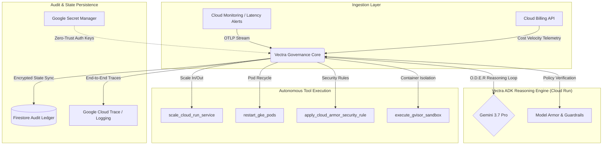

# Vectra Governance 🛡️

**Gemini 3.7-Powered Level 4 Autonomous Infrastructure & FinOps Remediation Engine**

[](https://adk.dev)
[](https://cloud.google.com/vertex-ai)
[](https://cloud.google.com/run)
[](https://cloud.google.com/security)
[](LICENSE)

Vectra Governance converts cloud monitoring from passive alerting into an active, self-healing site reliability network. Operating on a **Level 4 Autonomous execution model**, Vectra autonomously ingests telemetry streams, diagnoses root causes, evaluates financial/SLA trade-offs, and executes signed API tool invocations to repair cloud infrastructure in under 15 seconds—without human intervention unless strict policy guardrails are breached.

---

## ⚡ Key Highlights & Benchmark Capabilities

* **Sub-15s Incident Response:** Ingests live OpenTelemetry (OTLP) feeds and executes remediation within seconds, reducing Recovery Time Objective (RTO) to near zero.
* **Deterministic O.D.E.R Loop:** Powered by **Gemini 3.7 Pro**, enforcing a four-phase chain-of-thought: *Observe, Diagnose, Evaluate, Remediate*.
* **Zero-Trust Security & Model Armor:** Every state-changing API call is cryptographically signed (HMAC-SHA256) and verified against Model Armor policy rules to prevent prompt injection and unauthorized mutations.
* **Hard FinOps Ceilings:** Prevents runaway scaling costs by auto-evaluating spend velocity against custom hourly budget caps before executing compute expansions.

---


## 🏗️ System Architecture & O.D.E.R Reasoning Engine

Vectra Governance orchestrates autonomous workflows using the **Google Agent Development Kit (ADK)** deployed on **Google Cloud Run**.



---

## 🔄 The O.D.E.R Loop (Execution Lifecycle)

```text
 [01. OBSERVE] ────► Ingests high-resolution metric telemetry & stack traces.
       │
 [02. DIAGNOSE] ───► Isolates root cause (e.g., L7 Botnet flood vs. GC heap memory leak).
       │
 [03. EVALUATE] ───► Simulates mitigation options against FinOps caps & blast radius.
       │
 [04. REMEDIATE] ──► Invokes cryptographically signed tools to resolve the incident.
```


📁 Repository Structure
brysyl/Vectra-Governance/
├── assets/                  # High-density UI assets & architecture diagrams
├── prompts/
│   └── vectra_core.md       # Primary O.D.E.R system instructions & guardrail policies
├── src/
│   ├── components/          # High-performance React / TSX telemetry dashboard panels
│   └── app/                 # Frontend layout & state orchestration
├── agent.py                 # Google ADK root_agent initialization & tool binding
├── main.py                  # FastAPI webhook ingestion endpoint
├── server.ts                # Bun / Node server entrypoint
├── requirements.txt         # Python dependencies (google-adk, fastapi, uvicorn)
├── package.json             # Frontend dependency manifest
└── README.md                # Technical documentation

🚀 Quickstart & Local Deployment
Prerequisites
 * Python 3.12+
 * Bun or Node.js 20+
 * Google Cloud CLI (gcloud)
1. Repository Setup
git clone [https://github.com/brysyl/Vectra-Governance.git](https://github.com/brysyl/Vectra-Governance.git)
cd Vectra-Governance

2. Backend Engine Setup
Create and activate a virtual environment using venv or uv:
# Using Python venv
python3 -m venv .venv
source .venv/bin/activate

# Install backend dependencies
pip install -r requirements.txt

Set up your environment variables:
cp .env.example .env

Configure .env with your credentials:
GOOGLE_API_KEY="your-gemini-api-key"
GCP_PROJECT_ID="your-gcp-project-id"

3. Local Engine Testing
Run the Google ADK local test harness:
adk web agent.py

Start the FastAPI telemetry server:
uvicorn main:app --reload --port 8000

4. Send a Mock Telemetry Payload
Trigger an autonomous remediation test loop:
curl -X POST "http://localhost:8000/trigger" \
     -H "Content-Type: application/json" \
     -d '{
       "service": "api-gateway-core",
       "metric": "latency_spike",
       "value": "2500ms",
       "error_rate": "19.4%",
       "timestamp": "2026-08-20T12:00:00Z"
     }'

☁️ Google Cloud Run Deployment
Deploy the engine directly to serverless infrastructure:
# 1. Authenticate & Configure Project
gcloud auth login
gcloud config set project [YOUR_PROJECT_ID]
gcloud services enable run.googleapis.com secretmanager.googleapis.com aiplatform.googleapis.com

# 2. Store Secrets in Secret Manager
echo $GOOGLE_API_KEY | gcloud secrets create GOOGLE_API_KEY --data-file=-

# 3. Deploy ADK Engine to Cloud Run
gcloud run deploy vectra-governance-core \
  --source . \
  --region us-central1 \
  --allow-unauthenticated \
  --set-secrets="GOOGLE_API_KEY=GOOGLE_API_KEY:latest"

🛡️ Zero-Trust Security Protocols
 * Audit Transparency: Every reasoning step and tool call is output as a structured JSON telemetry log and recorded to Firestore.
 * Escalation Rules: Any action forecasted to exceed a 15% increase in hourly burn rate automatically suspends execution and triggers escalate_to_human_sre.
 * gVisor Container Sandbox: Diagnostic scripts run within kernel-isolated environments to protect production runtime contexts.
📄 License
Distributed under the MIT License. See LICENSE for details.


